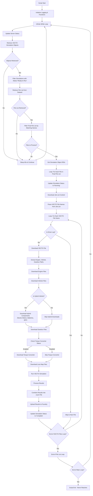

# VECTO Simulation Automation Script

## Overview

This PowerShell script automates the execution of VECTO (Vehicle Energy Consumption calculation TOol) simulations for Cummins heavy-duty vehicles. The script integrates with Palantir Foundry to retrieve simulation configurations, download required files, execute VECTO simulations, and upload results back to Foundry.

## Features

- **Automated VECTO Processing**: Fully automated workflow from simulation retrieval to result upload
- **Palantir Foundry Integration**: Seamless integration with Foundry datasets and ontologies
- **Robust Error Handling**: Job-level error detection with automatic job skipping on download failures
- **Hybrid Vehicle Support**: Handles both conventional and hybrid vehicle configurations
- **Comprehensive Logging**: Detailed logging with server notifications
- **File Management**: Automatic file archiving and cleanup
- **Monitoring File Upload**: Automatic upload of XML monitoring files to Foundry

## Prerequisites

### System Requirements
- Windows 10/11 with PowerShell 5.1+
- VECTO 4.3.3 executable
- Palantir Foundry access with appropriate permissions
- Network connectivity to Palantir Foundry APIs

### Required Software
- PowerShell 5.1 or higher
- VECTO 4.3.3 (installed in `C:\Users\scwpapp00217_adm1\Desktop\Vecto_Latest\VectoApp\`)
- Palantir Foundry API access

### Required Permissions
- Read access to Foundry datasets:
  - `ri.foundry.main.dataset.33bd89c4-0fe7-44cd-aaef-e59084df7013` (FLC files)
  - `ri.foundry.main.dataset.be9612ab-f245-4afc-af25-5f98eda0ca7f` (FCMC files)
  - `ri.foundry.main.dataset.2b338425-636f-4bbf-9274-ca38685be702` (Hybrid vehicle files)
  - `ri.foundry.main.dataset.37df1589-4daa-49d0-a45b-cc9a7578e166` (Conventional vehicle files)
  - `ri.foundry.main.dataset.c8327353-61e3-4c9f-b794-97f03dd89c64` (Gearbox files)
  - And others for hybrid components
- Write access to result datasets
- Ontology action execution permissions

## Installation

1. **Clone or Download** the script to your local machine
2. **Install VECTO 4.3.3** in the expected directory: `C:\Users\scwpapp00217_adm1\Desktop\Vecto_Latest\VectoApp\`
3. **Configure Authentication**:
   - Update the Bearer token in the script (line ~50)
   - Ensure proper API endpoints are configured
4. **Set Up Directories**:
   - Create `C:\Users\scwpapp00217_adm1\Desktop\Vecto_Latest\` for file processing
   - Create `E:\vecto_archive\` for file archiving
   - Create `E:\sync_scripts\logs\` for logging

## Configuration

### Key Configuration Variables

```powershell
# API Configuration
$foundry_base_url = "https://cummins.palantirfoundry.com"
$headers = @{
    "Authorization" = "Bearer YOUR_TOKEN_HERE"
    "Content-Type" = "application/json"
}

# Directory Paths
$working_directory = "C:\Users\scwpapp00217_adm1\Desktop\Vecto_Latest\"
$archive_directory = "E:\vecto_archive\"
$log_directory = "E:\sync_scripts\logs\"

# VECTO Configuration
$vecto_executable = "$working_directory\VectoApp\vectocmd.exe"
```

### Dataset Mappings

The script uses predefined dataset mappings for different file types:
- Engine files: `ri.foundry.main.dataset.33bd89c4-0fe7-44cd-aaef-e59084df7013`
- Vehicle files: Multiple datasets based on hybrid/conventional type
- Gearbox files: `ri.foundry.main.dataset.c8327353-61e3-4c9f-b794-97f03dd89c64`
- Hybrid components: Various datasets for electric motors, batteries, etc.

## Usage

### Running the Script

1. **Ensure Prerequisites**: All required software and permissions are in place
2. **Update Configuration**: Modify paths and authentication as needed
3. **Execute Script**: Run the PowerShell script

```powershell
# Run the script (will run continuously)
.\vecto_script_0910latest.ps1
```

### Script Behavior

- **Continuous Operation**: The script runs in an infinite loop with 60-second intervals
- **Job Processing**: Processes simulations with status "Ready to Run"
- **Error Handling**: Skips entire jobs if any file download fails
- **Result Upload**: Automatically uploads results to Foundry datasets
- **File Archiving**: Moves processed files to archive directory

## Workflow



## Error Handling

### Job-Level Error Handling

The script implements robust error handling that skips entire jobs when any file download fails:

- **Error Detection**: Monitors all file download operations
- **Job Skip Logic**: If any download fails, the entire job is skipped
- **Logging**: Detailed error logging with server notifications
- **Status Updates**: Updates simulation status appropriately

### Common Error Scenarios

1. **File Download Failures**: Network issues, permission problems, missing files
2. **JSON Parsing Errors**: Malformed response data
3. **VECTO Execution Errors**: Invalid input files, simulation failures
4. **API Authentication Issues**: Token expiration, permission changes

## Troubleshooting

### Common Issues

1. **Authentication Errors**
   - Check Bearer token validity
   - Verify API permissions
   - Ensure correct Foundry environment

2. **File Download Failures**
   - Verify network connectivity
   - Check dataset permissions
   - Confirm file paths exist

3. **VECTO Execution Errors**
   - Verify VECTO installation
   - Check input file validity
   - Review VECTO logs

4. **Permission Issues**
   - Ensure write access to result datasets
   - Verify ontology action permissions
   - Check file system permissions

### Debugging

- **Enable Verbose Logging**: Set `$debug = $true` for detailed output
- **Check Logs**: Review log files in `E:\sync_scripts\logs\`
- **Monitor Foundry**: Check simulation object status updates
- **Test Individual Components**: Run script sections manually for testing

## File Structure

```
palantir/
├── vecto_script_0910latest.ps1    # Main PowerShell script
├── readme.md                      # This documentation
└── prompt.txt                     # Additional context/notes
```

## Contributing

1. Fork the repository
2. Create a feature branch
3. Make your changes
4. Test thoroughly
5. Submit a pull request

### Development Guidelines

- Follow PowerShell best practices
- Add comprehensive error handling
- Update documentation for changes
- Test with both conventional and hybrid vehicles
- Ensure backward compatibility

## License

This project is proprietary software developed for Cummins Inc. All rights reserved.

## Support

For support or questions:
- Contact the development team
- Check the troubleshooting section
- Review error logs for debugging information

---

**Last Updated**: September 10, 2025
**Version**: 0910 Latest
**VECTO Version**: 4.3.3
